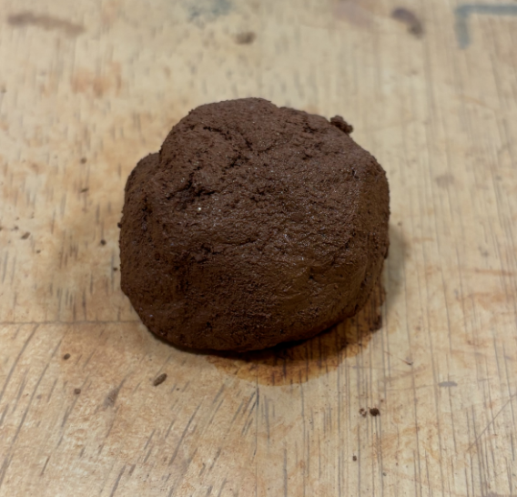
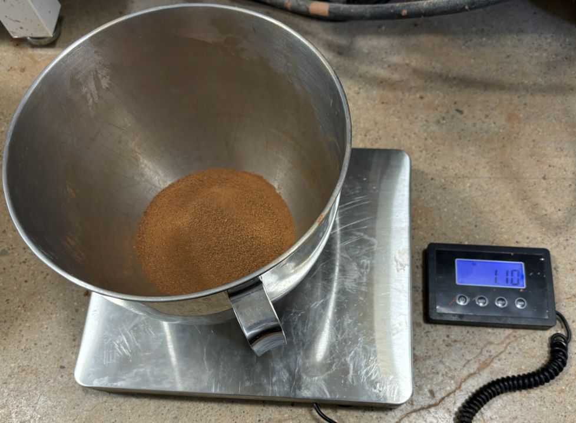
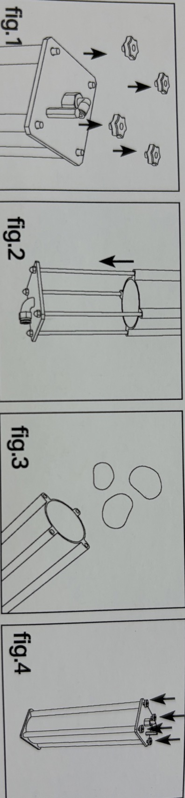
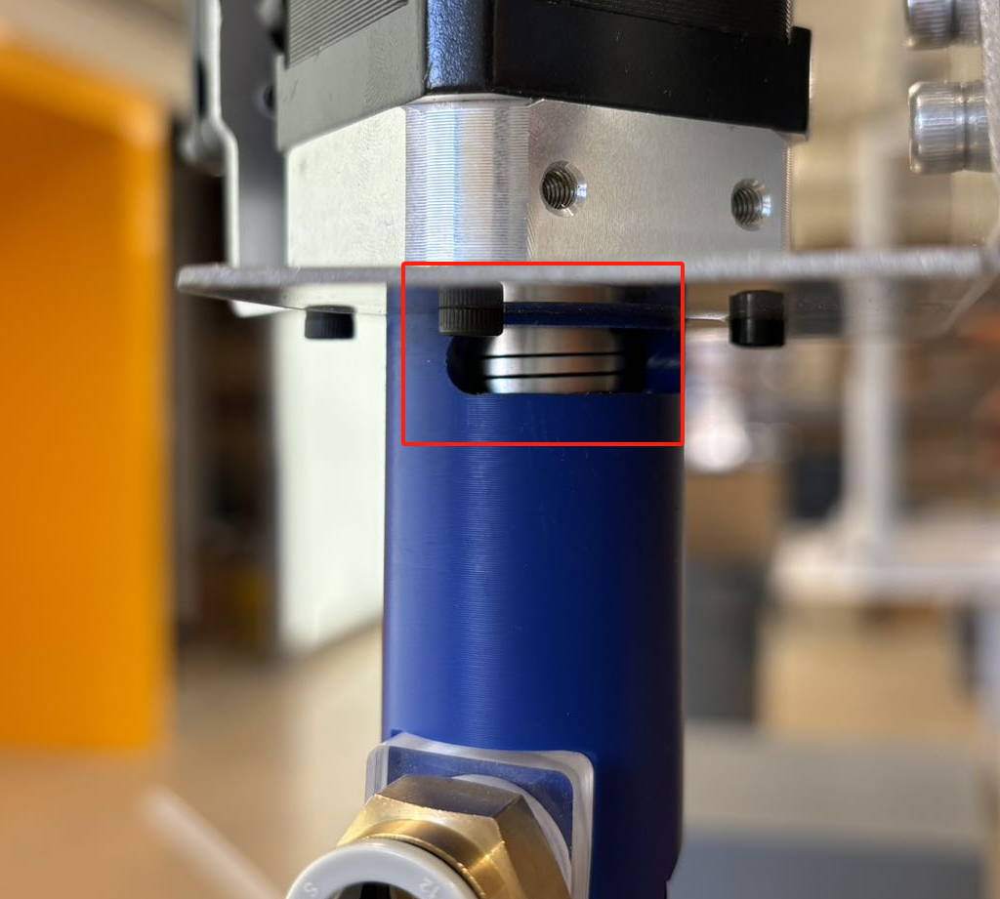
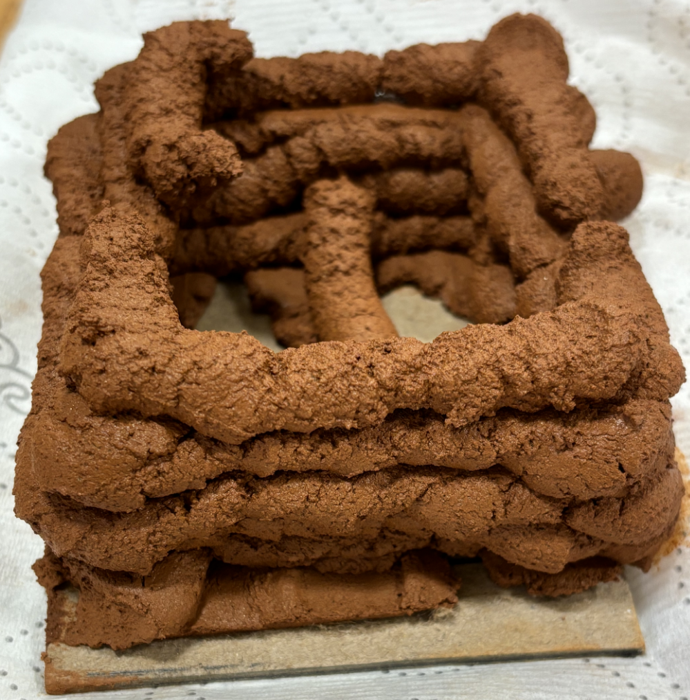

# **WASP Clay Kit Set-up**
*created by 2024/09/12*
### **Objectives: 
- **Prepare the material**
- **Load the material**
- **Run the extruder**
- **Connect to KUKA KR10 R1100-2**
- **Test printing**
---
## **Parts**
- Main:
    - Extruder: 1
    - Tank: 1
    - Nozzle: 4+2
- Accessory:
    - Anchor parts (3d printed): 5
    - Printing Pad
    - SD card: 1
    - Manual: 1
    - Teflon PTFE tubing
        - ID: 10mm(3/8"), OD: 12mm(1/2"), 660mm length
- Outer:
    - Step motor controller: ZK-SMC02
---
## **Resources**
- Instruction:
    - Clay Kit:
        - [YTB full process](https://youtu.be/1DjVC5MxJr4)
        - [Prepare Material](https://youtu.be/TF-vyjGUR0s?si=TRZQi4S5ISg4gyFT)
        - [Load Material](https://youtu.be/7mQYr0V-VUI?si=to4K8uLPDiFGJvih)
    - Step motor Controller:
        - [Manual](https://attach01.oss-us-west-1.aliyuncs.com/IC/Datasheet/GY20512.pdf#:~:text=ZK-SMC02CNCStepperMotorDriverZK-.%20MC.%20CNC%20Stepper%20Motor%20Driver1.%20ZK-SMC02%20is%20an%20operation)
- Files:
    - WASP_Clay_kit_Extruder
        - *Rhino Model with clear elements dimension*
    - WASP_Clay_kit_Tank
        - *Rhino Model with clear elements dimension*
    - WASP_prc_custom_tool
        - *Simplified Rhino Model for prc custom tool component*
---
## **Quick Tour**
1. **Load Material**
    - Process: 
        1. #### Sift the soil into loam
        2. #### 50g/ 100g sample test:
            - Flop test: *rub the material into ball and drop it from around 1.5ft to check whether the ball becomes flat*
            - Noodle test: *rub the material into noodle shape as ~2-3 cm diameter, hang it in air to check whether it fractures*
            - Hand Extrusion test: *Grab the material in hand and squeeze it, to check whether 5cm extrusion can hold*

            

            
            
            

            - *The left is the Flop test*
            - *The right is the Noodle test*

        - Note: 
            - The small sample test needs to be done before infilling materials into tank
            - The different percentage of water is tested in this step
            - Use Dichotomy, like test on 20%, 25%, 30%, 27%

        3. #### Calculate the percentage of water and Mixing
            - For testing printing in tank, 1kg and a bit below of loam (soil) is enough for 3 bases printing with 3 layers, depending on the size of printing base
                - my printing base size: 83 * 83 mm
            - For precise control of water and loam, put the materials on the electronic weighing scale (unit: g) in batches, like: 0.8kg material weighed as 2 batches with 400g for each batch
            - Add the desired percentage of water based on the weighed loam, and mix with blender

            

            
            
            

            - *The left is the loam on the electronic weighing scale (unit: kg)*
            - *The right is the mixture process in the blender*

        - Note: 
            - There are the loam and water loss during mixture, maybe prepare a bit extra water in first

2. **Load Material**
    

    
    

    - *Take off the pentagon nuts in the end with valve*
    - *Detach the valve end*
    - *Move piston up to the end and get materials on piston*
    - *Seal all nuts and let the nozzle end downwards*

    

    
    

    - *Rub it as a ball and drop onto the piston from the extruder hole face*

3. **Fix the extruder insitu**
    - *Already in place*
    - If replace the extruder, redo the anchor parts
4. **Connect Extruder's motor with motor controller**
    - *2 cables: Left circle refers to the 2 cables of the extruder's fan*
    - *4 cables: Right circle includes 4 cables for connecting to motor controller*

    

    
    

    - *The left is the Extruder's cable, the right is the welded controller's cable*
    - *Connect the same color cables of both extruder and controller*

    

    
    
    

    - *Power the controller, then turn on controller to see whether the extruder's motor spun*
    - *If not, check the back panel of controller's switch, and refer to Manual*

    

    
    
    

    | Switch Configuration | Mode        | Description                                                                 |
    |----------------------|-------------|-----------------------------------------------------------------------------|
    | ON, ON, ON           | NC (No Change) | Default state.                                                              |
    | OFF, ON, ON          | 1 (Full Step Mode) | Each pulse signal moves the motor by one full step angle.                    |
    | ON, OFF, ON          | 2/A         | Each step is divided into two parts, with a subdivision factor of 2.         |
    | ON, ON, OFF          | 2/B         | Each step is also divided into two parts, but may differ slightly from 2/A.  |
    | ON, OFF, OFF         | 4           | Each step is divided into four parts, with a subdivision factor of 4.        |
    | OFF, OFF, OFF        | 8           | Each step is divided into eight parts, with a subdivision factor of 8.       |
    | ON, OFF, OFF         | 16          | Each step is divided into sixteen parts, with a subdivision factor of 16.    |
    | OFF, OFF, OFF        | 32          | Each step is divided into thirty-two parts, with a subdivision factor of 32. |

5. **Link the tubing**
    - *The tubing inserts into the tank and Extruder*
    - *If it's hard to get off, press the gray-plaster ring in and pull again*
    - *The left is the original PTFE tubing, the right is the alternative FPE tubing*

    

    
    
    

6. **Connect to the Air Regulator**

7. **Test printing**
- #### Note: *Ehsan: 'No more than 30%'*
    - Trial 1: 45% water in loam (2024/09/19)
        - Observation: 
            - #### *The material was so thin that it all squeezed out after less than 1 bar pressure, and the motor wasn't on.*
    - Trial 2: 25% water in loam (2024/09/24)
        - Observation: 
            - #### The 50g sample test performs well, but it get stuck in the tubing when test printing
            - *The pressure was max to 7 bar (Max allowed working bar of tank and tubing), but the material still get stuck*
            - *The material moved slowly at first, and then it got stuck when going up inside the tubing*
            - *Analysis:*
                - The motor of extruder is not on
                - The water percentage is too low
                - The tubing is too long
                - The friction inside tubing is too strong
    - Trial 3: 32% water in loam (2024/09/26)
        - Observation: 
            - #### Successfully printed, still under paramter testing
            - #### The extruding speed from the extruder is different in comparison of the situation whether the motor is on: 
                - when motor is off, the required pressure is higher; when motor is on, it goes lower
            - #### When the volume inside the tank near finished, the required air pressure exceeds 7 bar
            - #### Due to the volume limit of the tank, only a few parameters are tested
            - #### Further test for printing parameters will be done
        - Basic Idea:
            - *In the small sample hand testing: 27% works well, 30% barely passed the noodle test due to its low viscosity*
            - *Fact: 25% test printing fails due to high viscosity*
            - *I suppose: the water loss during the process of either the mixture and the heat from air pressing of piston, resulted in the blocking inside the tubing*
            - *Idea: Reserve 2% extra water content initially and utilize the flowing property of 30%*
        - Test mode:
            - #### T1 mode

            

            
            

            - #### Params:
                - ### Width: ~10mm, Layer Height: 5-6mm, 
                - *Depends on the period of extruder's holding in position and height off the previous layer*
            - #### Working Condition:
                - ### Pressure: 45 psi (3.1 bar)
                - ### Motor:    On, CCW 200 r/s (Counter Clock wise)

        - Param range:
            - ### Pressure: 5 psi (0.34 bar) - 7bar (101.5psi)
            - ### Motor:    off/ on - CCW 200 - 400 r/s
            - Note:
                - *The lower bound of pressure depends on how thin of the material*
                - *The motor should be set as CCW running, otherwise CW running will conflict with the inlet air pressure*
                - *As the motor was set over 400, it will trip as overheating; then it will require the re-plugin and reset the red switch preferomentioned*

        - Printing speed:

            | Motor Status   | Motor Speed   |   Air Pressure (bar) |   Air Pressure (psi) |   Extrusion Speed (mm/s) |
            |:---------------|:--------------|---------------------:|---------------------:|-------------------------:|
            | off            |               |                 3.1  |                   45 |                      0.7 |
            | off            |               |                 3.8  |                   55 |                      1   |
            | off            |               |                 4    |                   58 |                      2   |
            | off            |               |                 4.8  |                   70 |                     20   |
            | on             | CCW-400       |                 0.34 |                    5 |                      2   |
            | on             | CCW-400       |                 0.69 |                   10 |                      5   |
            | on             | CCW-200       |                 3    |                   43 |                      2   |

        

    