# **WASP Clay Kit Set-up**
*created by 2024/09/12*
### **Objectives: 
- **Prepare the material**
- **Load the material**
- **Run the extruder**
- **Connect to KUKA KR10 R1100-2**
- **Test printing**
---
## **Parts**
- Main:
    - Extruder: 1
    - Tank: 1
    - Nozzle: 4+2
- Accessory:
    - Anchor parts (3d printed): 5
    - Printing Pad
    - SD card: 1
    - Manual: 1
    - Teflon PTFE tubing
        - ID: 10mm(3/8"), OD: 12mm(1/2"), 660mm length
- Outer:
    - Step motor controller: ZK-SMC02
---
## **Resources**
- Instruction:
    - Clay Kit:
        - [YTB full process](https://youtu.be/1DjVC5MxJr4)
        - [Prepare Material](https://youtu.be/TF-vyjGUR0s?si=TRZQi4S5ISg4gyFT)
        - [Load Material](https://youtu.be/7mQYr0V-VUI?si=to4K8uLPDiFGJvih)
    - Step motor Controller:
        - [Manual](https://attach01.oss-us-west-1.aliyuncs.com/IC/Datasheet/GY20512.pdf#:~:text=ZK-SMC02CNCStepperMotorDriverZK-.%20MC.%20CNC%20Stepper%20Motor%20Driver1.%20ZK-SMC02%20is%20an%20operation)
- Files:
    - WASP_Clay_kit_Extruder
        - *Rhino Model with clear elements dimension*
    - WASP_Clay_kit_Tank
        - *Rhino Model with clear elements dimension*
    - WASP_prc_custom_tool
        - *Simplified Rhino Model for prc custom tool component*
---
## **Tune report**
1. **Load Material**
    - Process: 
        1. #### Sift the soil into loam
        2. #### 50g/ 100g sample test:
            - Flop test: *rub the material into ball and drop it from around 1.5ft to check whether the ball becomes flat*
            - Noodle test: *rub the material into noodle shape as ~2-3 cm diameter, hang it in air to check whether it fractures*
            - Hand Extrusion test: *Grab the material in hand and squeeze it, to check whether 5cm extrusion can hold*

            

            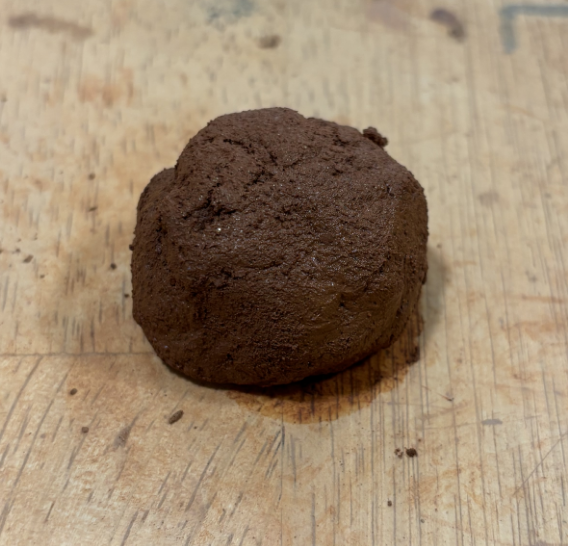
            
            

            - *The left is the Flop test*
            - *The right is the Noodle test*

        - Note: 
            - The small sample test needs to be done before infilling materials into tank
            - The different percentage of water is tested in this step
            - Use Dichotomy, like test on 20%, 25%, 30%, 27%

        3. #### Calculate the percentage of water and Mixing
            - For testing printing in tank, 1kg and a bit below of loam (soil) is enough for 3 bases printing with 3 layers, depending on the size of printing base
                - my printing base size: 83 * 83 mm
            - For precise control of water and loam, put the materials on the electronic weighing scale (unit: g) in batches, like: 0.8kg material weighed as 2 batches with 400g for each batch
            - Add the desired percentage of water based on the weighed loam, and mix with blender

            

            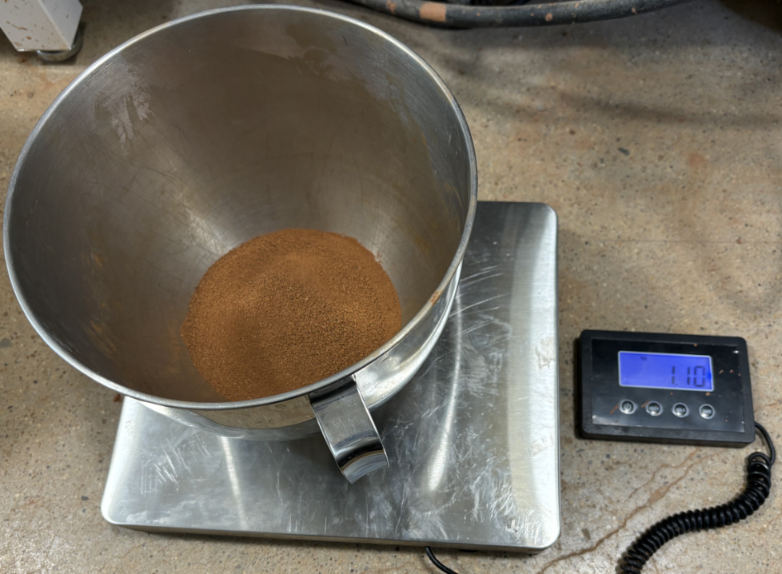
            
            

            - *The left is the loam on the electronic weighing scale (unit: kg)*
            - *The right is the mixture process in the blender*

        - Note: 
            - There are the loam and water loss during mixture, maybe prepare a bit extra water in first

2. **Load Material**
    

    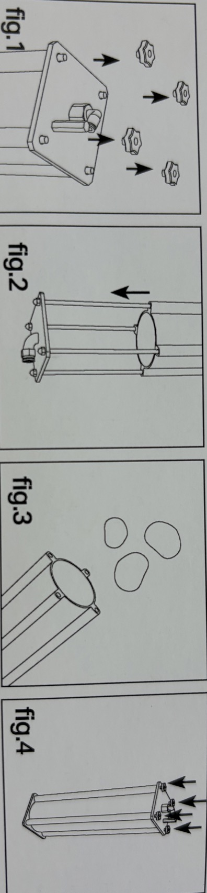
    

    - *Take off the pentagon nuts in the end with valve*
    - *Detach the valve end*
    - *Move piston up to the end and get materials on piston*
    - *Seal all nuts and let the nozzle end downwards*

    

    
    

    - *Rub it as a ball and drop onto the piston from the extruder hole face*

3. **Fix the extruder insitu**
    - *Already in place*
    - If replace the extruder, redo the anchor parts
4. **Connect Extruder's motor with motor controller**
    - *2 cables: Left circle refers to the 2 cables of the extruder's fan*
    - *4 cables: Right circle includes 4 cables for connecting to motor controller*

    

    
    

    - *The left is the Extruder's cable, the right is the welded controller's cable*
    - *Connect the same color cables of both extruder and controller*

    

    
    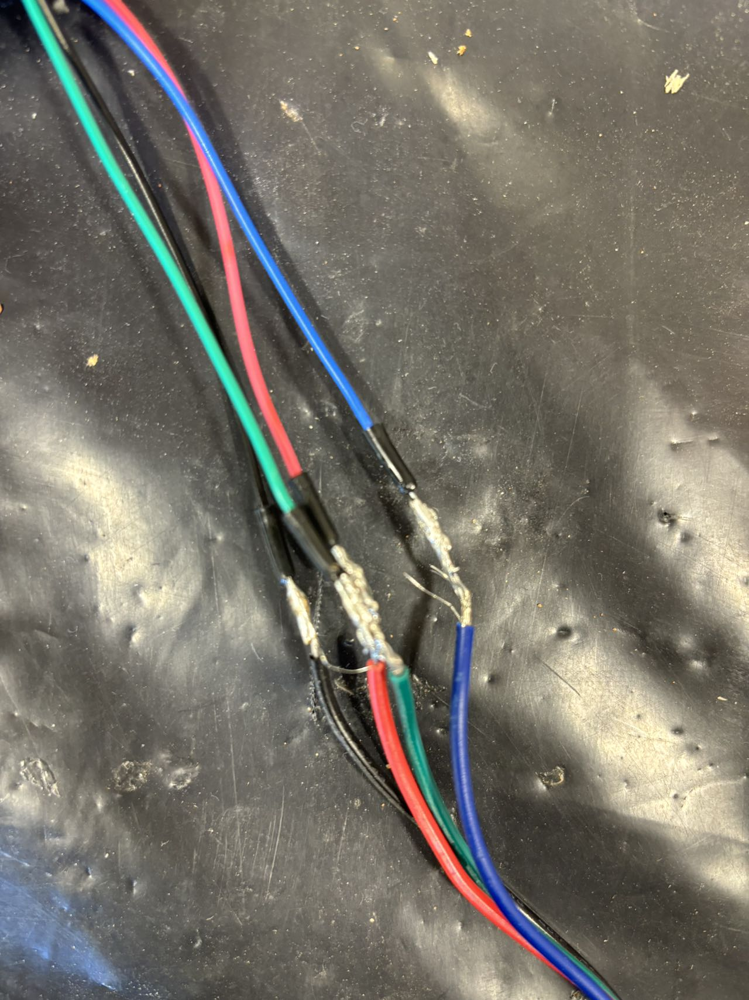
    

    - *Power the controller, then turn on controller to see whether the extruder's motor spun*
    - *If not, check the back panel of controller's switch, and refer to Manual*

    

    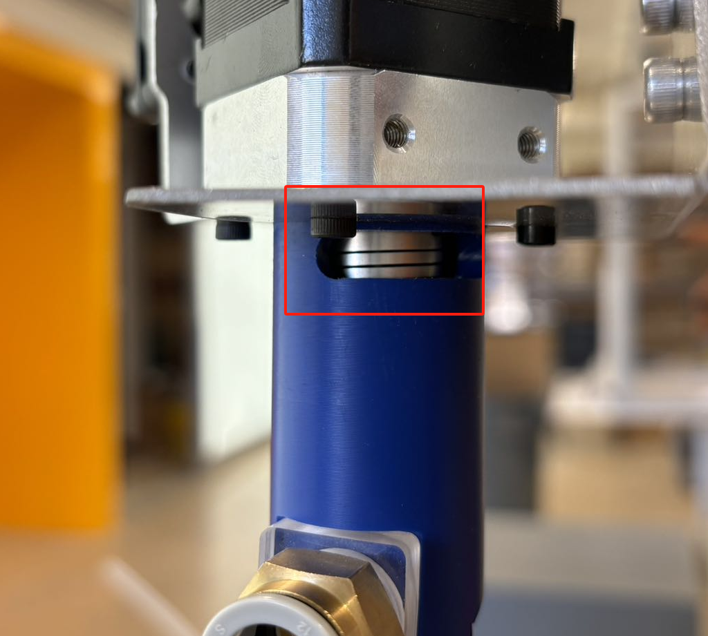
    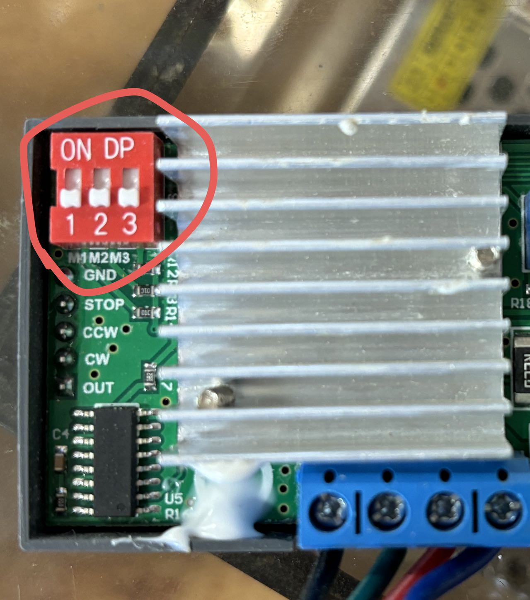
    

    | Switch Configuration | Mode        | Description                                                                 |
    |----------------------|-------------|-----------------------------------------------------------------------------|
    | ON, ON, ON           | NC (No Change) | Default state.                                                              |
    | OFF, ON, ON          | 1 (Full Step Mode) | Each pulse signal moves the motor by one full step angle.                    |
    | ON, OFF, ON          | 2/A         | Each step is divided into two parts, with a subdivision factor of 2.         |
    | ON, ON, OFF          | 2/B         | Each step is also divided into two parts, but may differ slightly from 2/A.  |
    | ON, OFF, OFF         | 4           | Each step is divided into four parts, with a subdivision factor of 4.        |
    | OFF, OFF, OFF        | 8           | Each step is divided into eight parts, with a subdivision factor of 8.       |
    | ON, OFF, OFF         | 16          | Each step is divided into sixteen parts, with a subdivision factor of 16.    |
    | OFF, OFF, OFF        | 32          | Each step is divided into thirty-two parts, with a subdivision factor of 32. |

5. **Link the tubing**
    - *The tubing inserts into the tank and Extruder*
    - *If it's hard to get off, press the gray-plaster ring in and pull again*
    - *The left is the original PTFE tubing, the right is the alternative FPE tubing*

    

    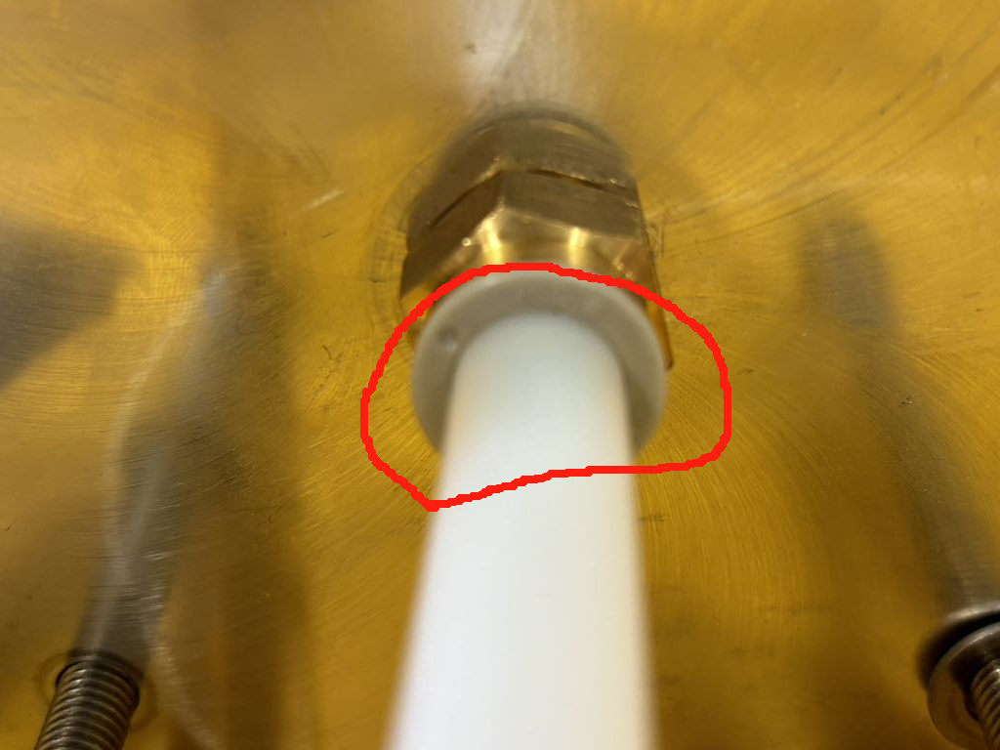
    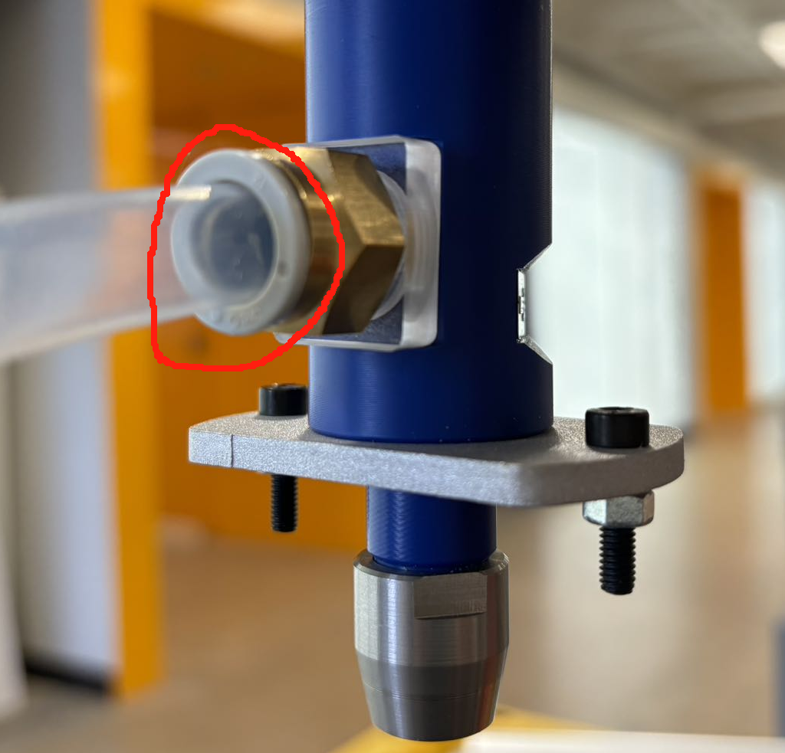
    

6. **Connect to the Air Regulator**

7. **Test printing**
- #### Note: *Ehsan: 'No more than 30%'*
    - Trial 1: 45% water in loam (2024/09/19)
        - Quantity of loam: ~ 2kg
        - Observation: 
            - #### *The material was so thin that it all squeezed out after less than 1 bar pressure, and the motor wasn't on.*
    - Trial 2: 25% water in loam (2024/09/24)
        - Quantity of loam: ~ 1kg
        - Observation: 
            - #### The 50g sample test performs well, but it get stuck in the tubing when test printing
            - *The pressure was max to 7 bar (Max allowed working bar of tank and tubing), but the material still get stuck*
            - *The material moved slowly at first, and then it got stuck when going up inside the tubing*
            - *Analysis:*
                - The motor of extruder is not on
                - The water percentage is too low
                - The tubing is too long
                - The friction inside tubing is too strong
    - Trial 3: 32% water in loam (2024/09/26)
        - Quantity of loam: 800g
        - Observation: 
            - #### Successfully printed, still under paramter testing
            - #### The extruding speed from the extruder is different in comparison of the situation whether the motor is on: 
                - when motor is off, the required pressure is higher; when motor is on, it goes lower
            - #### When the volume inside the tank near finished, the required air pressure exceeds 7 bar
            - #### Due to the volume limit of the tank, only a few parameters are tested
            - #### Further test for printing parameters will be done
        - Basic Idea:
            - *In the small sample hand testing: 27% works well, 30% barely passed the noodle test due to its low viscosity*
            - *Fact: 25% test printing fails due to high viscosity*
            - *I suppose: the water loss during the process of either the mixture and the heat from air pressing of piston, resulted in the blocking inside the tubing*
            - *Idea: Reserve 2% extra water content initially and utilize the flowing property of 30%*
        - Test mode:
            - #### T1 mode

            

            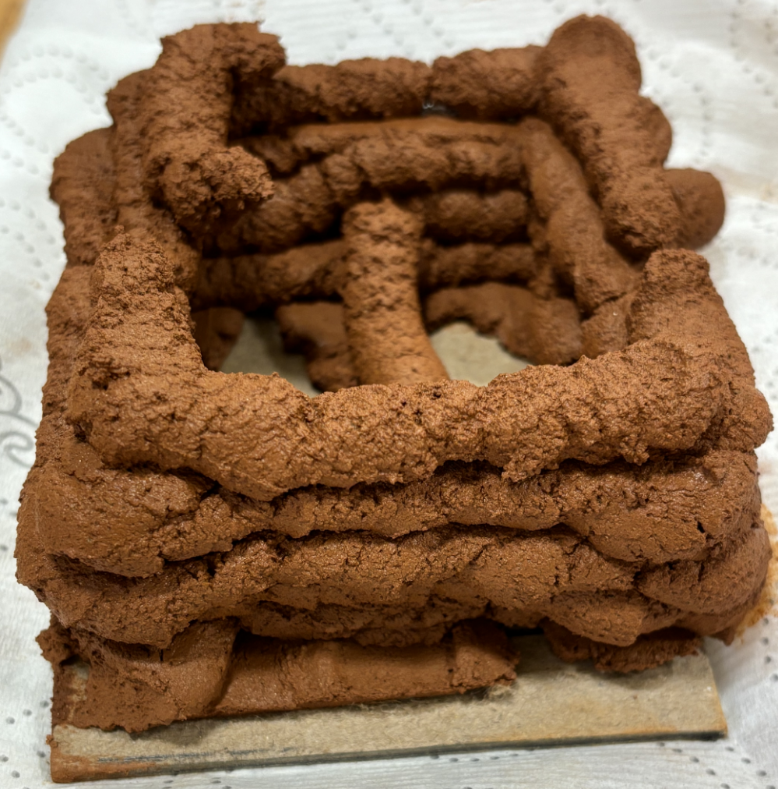
            

            - #### Params:
                - ### Width: ~10mm, Layer Height: 5-6mm, 
                - *Depends on the period of extruder's holding in position and height off the previous layer*
            - #### Working Condition:
                - ### Pressure: 45 psi (3.1 bar)
                - ### Motor:    On, CCW 200 r/s (Counter Clock wise)

        - Param range:
            - ### Pressure: 5 psi (0.34 bar) - 7bar (101.5psi)
            - ### Motor:    off/ on - CCW 200 - 400 r/s
            - Note:
                - *The lower bound of pressure depends on how thin of the material*
                - *The motor should be set as CCW running, otherwise CW running will conflict with the inlet air pressure*
                - *As the motor was set over 400, it will trip as overheating; then it will require the re-plugin and reset the red switch preferomentioned*

        - Printing speed:

            | Motor Status   | Motor Speed   |   Air Pressure (bar) |   Air Pressure (psi) |   Extrusion Speed (mm/s) |
            |:---------------|:--------------|---------------------:|---------------------:|-------------------------:|
            | off            |               |                 3.1  |                   45 |                      0.7 |
            | off            |               |                 3.8  |                   55 |                      1   |
            | off            |               |                 4    |                   58 |                      2   |
            | off            |               |                 4.8  |                   70 |                     20   |
            | on             | CCW-400       |                 0.34 |                    5 |                      2   |
            | on             | CCW-400       |                 0.69 |                   10 |                      5   |
            | on             | CCW-200       |                 3    |                   43 |                      2   |

8. **Cleaning the equipment**

9. **Param test**
    - #### Based on trial 3: 32%, red loam
    - Trial 4: 
        - ### 31% water in loam (2024/10/02)
            - *Quantity of loam: 800g*
            - *Water added: 359.42g*
                - Error in water quantity: 0.5g
            - *Actual Quantity of loam/water mixture loaded in tank: 1100g*
            
        - Objectives:
            - *Get the param of air pressure, motor speed, and their corresponding printing speed*
            - *Understand the different noticeable phase during printing*

        - Process: 
            - ##### Phase 1: Load material in tubing
            - ##### Phase 2: Increase pressure till smooth extrusion
            - ##### Phase 3: Find the threshold pressure and measure extruding speed
            - ##### Phase 4: Map the motor state and extruding speed with reduce the pressure at each step

        - Observation: 
        - #### Phase 1: see the material(mixture) flowing in tubing
            - *Pressure: 0.5-1 bar (14.5 psi)*, motor: off
            - *Note:* 
                - *Before loading the material, let the motor idle to get rid of the big solid chunk of soil: the chunk would fall out of the interior spiral tubing of motor*
                - *If the diameter of rubbed material ball is much smaller than the tank diameter, the air would appear in the tubing, which may affect the final printing*
                - *In this trial, the rubbed material balls are 4: [4/5, 2/3, 1/2, 1/3] - the ratio of the ball diameter over the tank diameter, there are 3 air gaps watched in tubing*
                - *The supposed functional diameter of rubbed ball now are over 1/2 of the tank diameter (This will be re-discussed in the next printing)*

        - #### Phase 2: 
            - Increase the air pressure, and try the turn on/off the motor, the extruder gets a bit reaction (*extrude a bit*) but then stuck
            - The material would flow unobstructedly till reaching the threshold value of pressure (phase 3)
            - Trial range:
                - Air pressure: [0.5, 1, 1.5, 2, 2.5, 3, 4, 5, 6]
                    - #### 3 bar (45psi) air pressure starts to push the material out of the extruder, but quickly stucks
                    - *the air pressure setting lower than 3 bar could push the material in tubing, the increasing of pressure only make the materials flow faster in tubing*
                    - *When the air pressure is increased to 5 bar (75 psi), and with motor state: CCW 400r/s, the extruding of material is still unbearably slow*
                    - #### 6 bar (90psi) air pressure lets the material extrude smoothly with motor off: threshold value for starting printing
                - Motor state: [off, CW, CCW(200, 300, 400)]
                    - During this phase, the state of motor does not have influence on whether the material can be extruded smoothly
                    - The requirement-fulfilled signal of reaching the required air pressure: 6bar is observed under motor off
            - *Note:* 
                - *When the pressure increased, the air in tubing gradually disappeared*
                - *There is another sign where the current air pressure is not working: the motor state, which means the motor would stop working after tens of seconds if the air pressure is not fulfilled*
                - *To restart the motor, I need to plug off and in again the motor's power cable*
                - *Cleaning the inner part of extruder is hard, thus I had only removed the noticeable soil chunk of extruder-- where I thk this probably leads to the much greater pressure for extruder's working condition in this trial*

        - #### Phase 3: 
            - #### After the pressure is increased to 6 bar (90 psi), the material automatically flowed out of the extruder with motor off, and the speed is close to 1 mm/s
            - #### Staying on 6 bar, when the motor is on, the flowing speed is pretty high, the peak value is over 10 mm/s (motor state: CCW 200 r/s), which is faster than control
            - *To avoid the quick running out of the material, I did the following test with lower pressure to get the mapping of motor speed and extruding speed under given pressure*
            - #### Staying on 6 bar, when the motor is on, the first several segments are spiral and not tightly bonded together, then the materials would bond together after the spiral segments
            - *The flowing speed of the bonded extrusion is pretty high, the peak value is over 12 mm/s, which was faster than control*
            - #### The following phase was to track the mapping of motor state and extruding speed with the different given pressure, where the air pressure was reduced from 6 bar
                - ### *The measurement:*
                    - Let the material be extruded out, and watch the stopwatch, record the seconds for passing each centimeter, filter out the MAX/MIN and then average the passing seconds of each centimeter
                    - Each round of timing ends with the extruded segments fell apart from extruder
            - *Note:* 
                - *Due to the inner spiral space of extruder, the extruded and hung segments would swing before falling apart, which increase the seconds for passing each centimeter*

                

                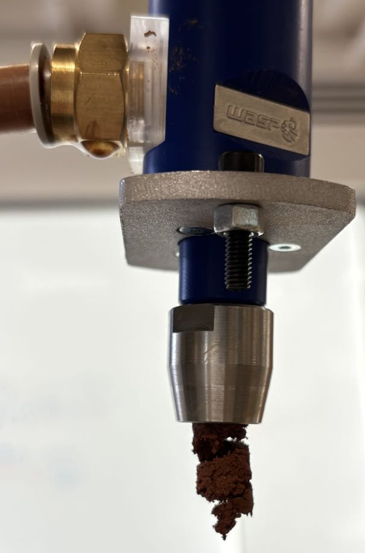
                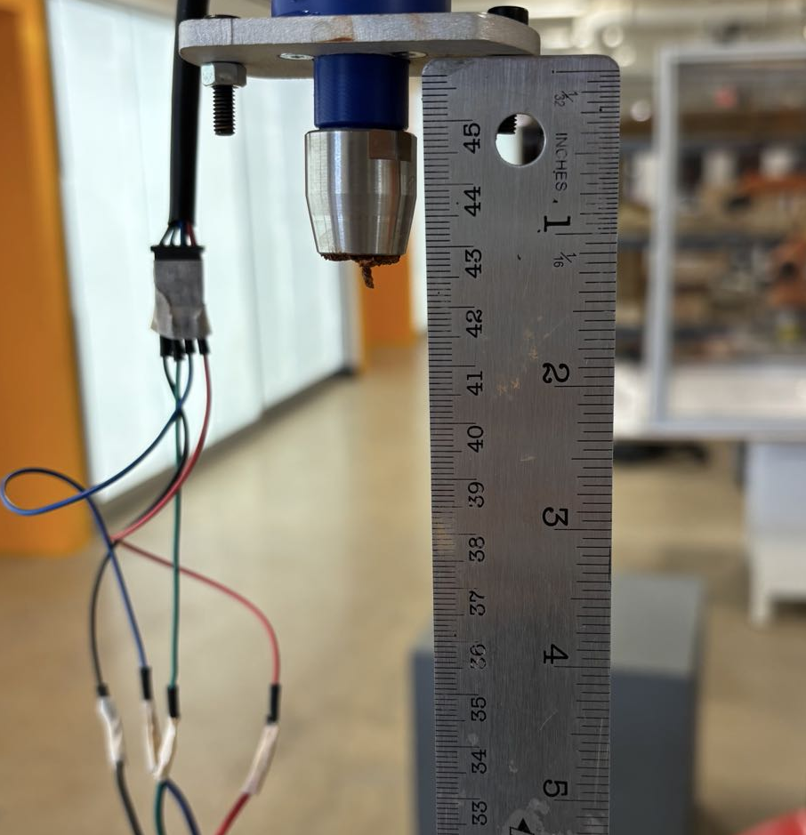
                

        
                - *The left is the spiral extrusion for the first segments*
                - *The measuring: the counting reader usually starts from 42cm to 32cm, but the total length of each segment before falling apart varied due to air pressure, motor state, and water percentage*

        - #### Phase 4: 
            - Air pressure: [5.5, 5, 4.5, 4, 3.5 bar]
            - Motor state: [off, CW, CCW(200, 300, 400)]
            - *Note:* 
                - *Each round of testing, air pressure is set constant to test the effect of motor state on extruding speed*
                - #### Due to under 6 bar (90psi) with motor on, the extruding speed is too high to investigate on the multiple motor state setting, thus the testing was conducted on the reduced air pressure from 6 bar; for getting more speed spec over 6-7 bar, the another person is required
                - *The CW state actually retracts the extruded segments of materials in reasonable pressure setting, and the CW state of motor only slowed down the extrusion in the too high pressure like 6 bar where complexed the mapping*
                - #### The material nearly ran out when testing on 3.5 bar (50 psi), thus the mapping at 3.5 bar may not be accurate
                - *There is a phenomenon: the higher motor speed was set, the extruded filament could hang longer before falling apart. For example, given 5 bar, CCW 200 could hold ~ 100mm filament consistent; while CCW 400 could hold ~ 200mm filament consistent*
                - #### There are 2 signs for the materials' running out:
                    - The flake shape of extruded filament;
                    - The printing speed did not increase with higher motor setting, then increasing the pressure did not help either

                

                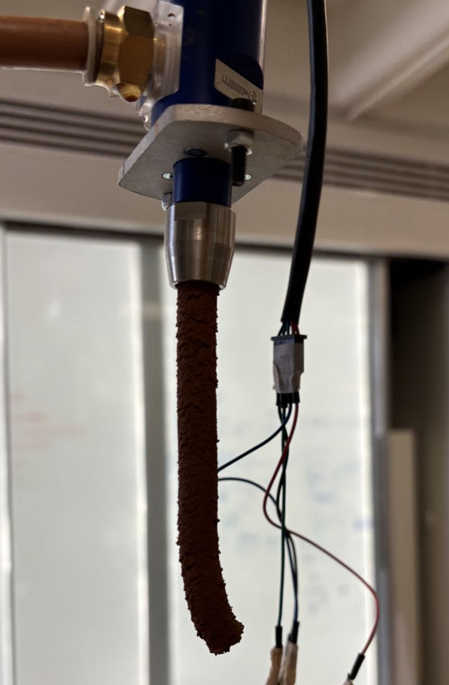
                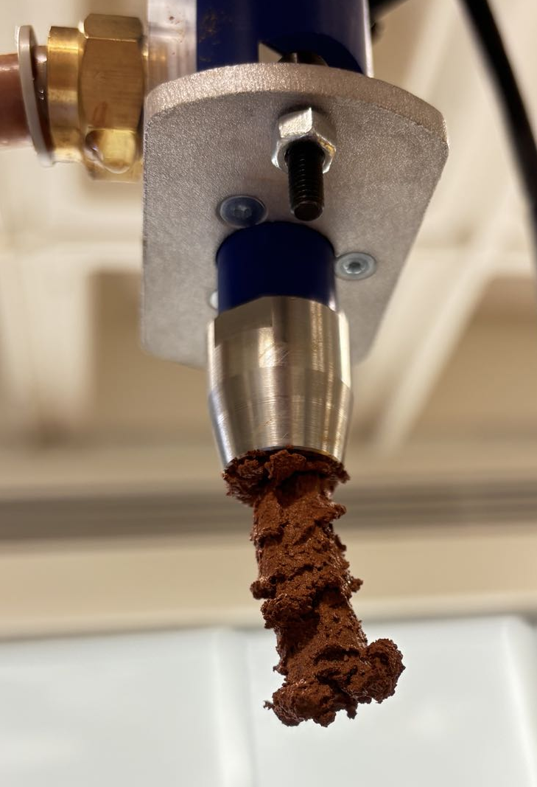
                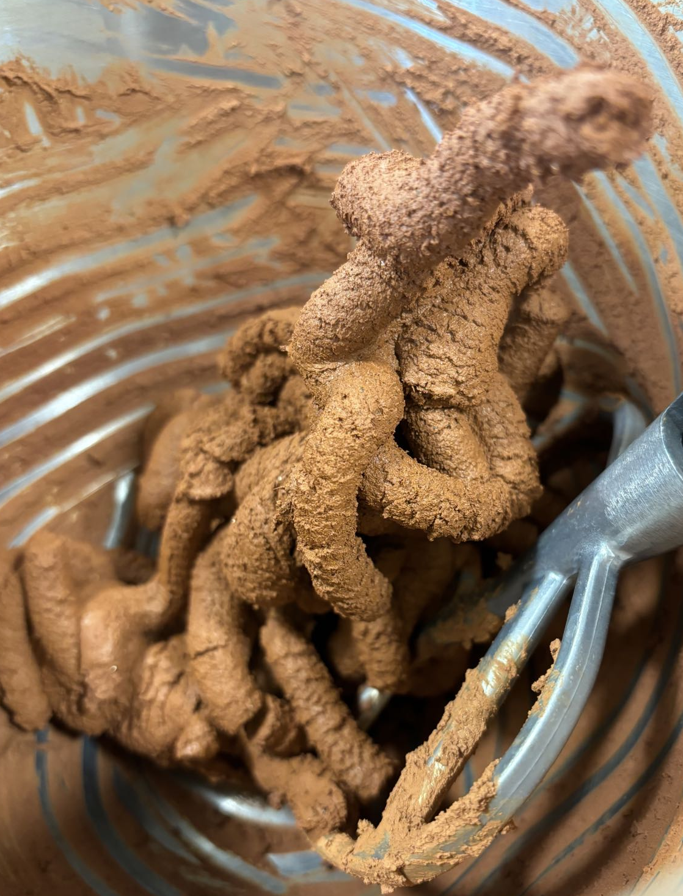
                

            - *The left is the normal extruded filament: without obvious flake shape and consistent everywhere*
            - *The mid is the flake shape of extrusion, where the process is slow and the increasing motor speed and air pressure did not help*
            - *The total quantity for extruded filament, around 700 g*

        - ### Mapping:
            | Pressure (bar / psi) | Motor (off / CCW r/s) | Extruding speed (seconds for 10 mm)  | Avg Speed (mm/s) |
            |----------------------|-----------------------|--------------------------------------|-----------|
            | 6 / 90               | off                   | 12, 10, 8                            | 1.1       |
            |                      | 200                   | 1.2, 1.3, 1.1                        | 12.0      |
            |                      | 300                   | 0.5, 0.55, 0.6                       | 20.0      |
            |                      | 400                   | 0.4, 0.45, 0.5                       | 22.2      |
            | 5.5 / 80             | off                   | 6, 5, 7                              | 1.7       |
            |                      | 200                   | 2, 1.5, 1.7                          | 5.8       |
            |                      | 300                   | 1, 1.5, 1.3                          | 8.1       |
            |                      | 400                   | 0.85, 0.75, 0.5                      | 15.0      |
            | 5 / 75               | off                   | null                                 | null      |
            |                      | 200                   | 2.5, 2, 1.85                         | 4.8       |
            |                      | 300                   | 1.3, 1.1, 1.4                        | 8.0       |
            |                      | 400                   | 1.3, 0.8, 1.1                        | 9.8       |
            | 4.5 / 65             | off                   | null                                 | null      |
            |                      | 200                   | 2.5, 2, 3                            | 4.1       |
            |                      | 300                   | 2, 1.5, 2.5                          | 5.2       |
            |                      | 400                   | 1.5, 1.2, 1.3                        | 7.6       |
            | 4 / 60               | off                   | null                                 | null      |
            |                      | 200                   | 2.5, 3, 3.5                          | 3.4       |
            |                      | 300                   | 2.5, 2.15, 2                         | 4.6       |
            |                      | 400                   | 2.4, 2.1, 2.2                        | 4.5       |
            | 3.5 / 50             | off                   | null                                 | null      |
            |                      | 200                   | 3.7, 3.4, 3.6                        | 2.8       |
            |                      | 300                   | 2.4, 2.6, 2.3                        | 4.1       |
            |                      | 400                   | 3.6, 3, 3.6                          | 3.0       |

        - *Error:*
            - #### pressure conversion:
                - *Since the readings from the pressure regulator may not be exact, the pressure values in bar and psi might contain small deviations. However, this should not drastically affect the extruding speed, as long as the pressure remains within the recorded ranges (e.g., 6 bar, 5.5 bar, etc.). The most significant error would likely arise if the pressure changes quickly or if the regulator readings are off by a significant margin*
            - #### Timing and Recording Method
                - The timing was recorded manually through a phone app, introducing potential human error. This could lead to inaccurate speed measurements, especially for smaller timing differences (e.g., between 0.4s and 0.5s). Repeated measurements under controlled conditions would reduce the error.
                - As the idea is to identify the most frequent timing records, we should focus on the timings that appear more consistently across the pressure and motor settings.
            - #### Null/No Extrusion
                - For conditions where null was recorded, the extrusion did not happen, telling those pressure setting did not force material flow without motor on
